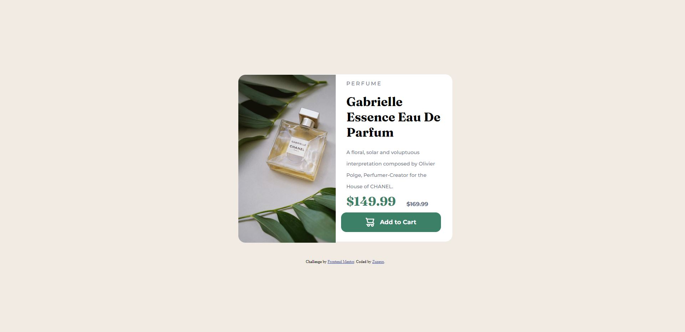

# Frontend Mentor - Product preview card component solution

This is a solution to the [Product preview card component challenge on Frontend Mentor](https://www.frontendmentor.io/challenges/product-preview-card-component-GO7UmttRfa). Frontend Mentor challenges help you improve your coding skills by building realistic projects. 

## Table of contents

- [Overview](#overview)
  - [The challenge](#the-challenge)
  - [Screenshot](#screenshot)
  - [Links](#links)
- [My process](#my-process)
  - [Built with](#built-with)
  - [What I learned](#what-i-learned)
  - [Continued development](#continued-development)
- [Author](#author)


**Note: Delete this note and update the table of contents based on what sections you keep.**

## Overview

### The challenge

Users should be able to:

- View the optimal layout depending on their device's screen size
- See hover and focus states for interactive elements

### Screenshot




### Links

- Solution URL: [https://github.com/zuzexx/FM_ProductPreviewCard]
- Live Site URL: [https://fm-product-preview-card.vercel.app/]
## My process

### Built with

- Semantic HTML5 markup
- SCSS
- Flexbox
- Mobile-first workflow
### What I learned

I learned how to change images depending on the deskop width.

```css
.image{
    border-top-left-radius: 20px;
    border-top-right-radius: 20px;
    width:100%; 
    background-image: url("/images/image-product-mobile.jpg");
    background-size:cover;
    margin-top: -70px;
    
    @include desktop(){
        border-top-right-radius: 0px;
        border-bottom-left-radius: 20px;
       width: 550px;
       height:440px;
       margin-top: 1px;
       background-image: url("/images/image-product-desktop.jpg");
           

    }
}
```

### Continued development

I want to focus on getting a better eye for design.


## Author

- Frontend Mentor - [@zuzexx](https://www.frontendmentor.io/profile/zuzexx)
- LinkedIn - [@tjasa](https://www.linkedin.com/in/tjasa-zilavec/)


